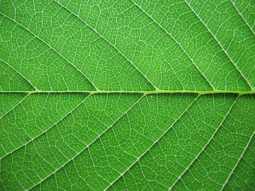
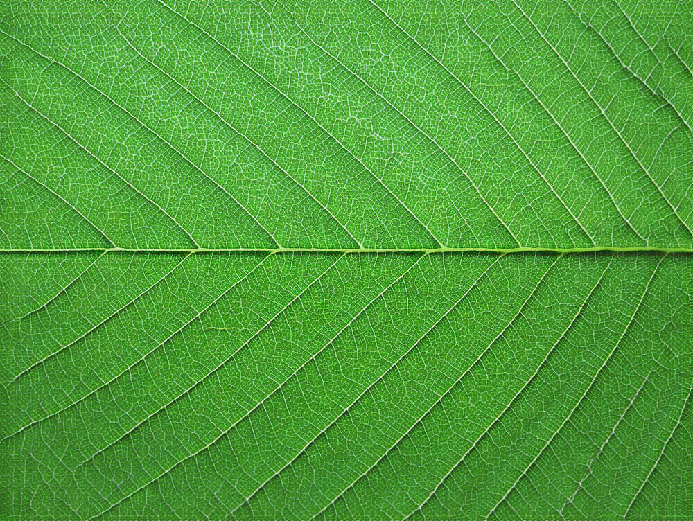

# Non-stationary texture synthesis using adversarial expansions

[comment]: <> ()

This is my newer version code adapted from the official one [Non-stationary texture synthesis using adversarial expansions](https://github.com/jessemelpolio/non-stationary_texture_syn).

[comment]: <> (This code was mainly adapted by [Zhen Zhu]&#40;https://github.com/jessemelpolio&#41; on the basis of the repository [CycleGAN]&#40;https://github.com/junyanz/pytorch-CycleGAN-and-pix2pix&#41;.)

[comment]: <> ()

[comment]: <> (If you use this code for your research, please cite:)

[comment]: <> (Non-stationary texture synthesis using adversarial expansions  )

[comment]: <> ([Yang Zhou]&#40;https://zhouyangvcc.github.io&#41;\*, [Zhen Zhu]&#40;https://github.com/jessemelpolio&#41;\*, [Xiang Bai]&#40;http://mclab.eic.hust.edu.cn/~xbai/&#41;, [Dani Lischinski]&#40;http://www.cs.huji.ac.il/~danix/&#41;, [Daniel Cohen-Or]&#40;http://www.cs.tau.ac.il/~dcor/pubs.html&#41;, [Hui Huang]&#40;http://vcc.szu.edu.cn/~huihuang&#41;  )

[comment]: <> (In SIGGRAPH 2018. &#40;* equal contributions&#41;)

### What's New?
* The code can be run on Windows 10, Python 3.7.9, Pytorch 1.6.0, CUDA 10.1.
* Fixed HTML stuff(not used)

### Run
#### Download VGG
Download VGG model from [here](https://bethgelab.org/media/uploads/pytorch_models/vgg_conv.pth) and put it inside `models` folder.

#### Train
```
python train.py --dataroot ./datasets/half/5 --name 5_half_style_14x14 --use_style --no_flip --no_lsgan --padding_type replicate --model half_style --which_model_netG resnet_2x_6blocks --which_model_netD n_layers --n_layers_D 4 --which_direction AtoB --lambda_A 100 --dataset_mode half_crop --norm batch --pool_size 0 --resize_or_crop no --niter_decay 50000 --niter 50000 --save_epoch_freq 2000
```

### My Results
Input                      |  Synthesized
:-------------------------:|:-------------------------:
  |  

### Acknowledgements
[Official Code](https://github.com/jessemelpolio/non-stationary_texture_syn)

